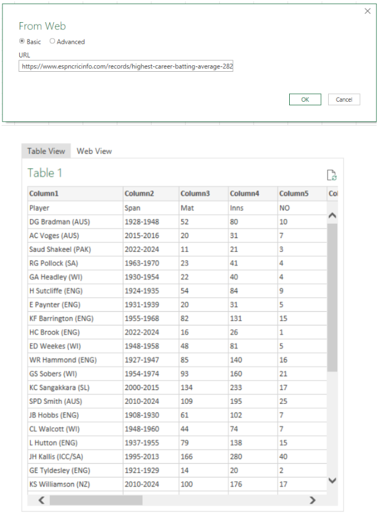

# Overview
This project was created for my preparation on focusing on data analyst roles. This helped me practice and apply all the skills I've learned from Data Analysis courses and tutorials. The project will focus on Data Cleaning using Python and Data Transformation and Visualization using Power BI.

The data sourced from sports website [ESPN Cricket section](https://www.espncricinfo.com/records/highest-career-batting-average-282910) and tutorial from a youtube channel (Ryan & Matt Data Science) on data analysis. Data contains a records of highest career batting average in history. It consists of players name and their country, years and matches played, and personal cricket records.

Through a series of Python scripts, I explore key questions such as average career length of the player, batting strike rate, players who played the most and number of players per country

# Questions

These are the questions I want to answer in my project:

1. What is the career average length?
2. What is the average batting strike rate for player who played more than 10 years in the league?
3. How many players played cricket even before the cricket league was established (1960)?
4. Max highest innings score by country
5. What are the averages of Hundreds, Fifties, Ducks (0) by country

# Tools I Used

For my deep dive into the data analyst job market, I harnessed the power of several key tools:

- **MS Excel:** Importing the datasets from a website and saving as a csv file.
- **Python:** For data cleaning and manipulation. I also used the following Python libraries:
    - **Pandas Library:** Data analysis and cleaning.
    - **Matplotlib Library:** simple and quick data visualization for analyzing data irregularities.
    - **Numpy Library:** Numerical calculation (Pandas backbone).
- **Jupyter Notebooks:** The tool I used to run my Python scripts which let me easily include my notes and analysis.
- **Visual Studio Code:** My ide for executing my Python scripts.
- **Power BI (Power Query)** Used for data transformation (power query) and interactive data visualization for deeper Data analysis insights.

# Data Preparation - Data Cleaning and Tranformation

This section outlines the steps taken to prepare the data for analysis.

## Import Libraries and Dataset

Importing necessary libraries. Importing dataset from a website and loading it in jupyter notebook, followed by initial data cleaning tasks to ensure data quality.

Import the dataset using MS Excel thru Data ribbon using From Web menu transform data, using this link - [Highest Career Batting average](https://www.espncricinfo.com/records/highest-career-batting-average-282910) 



```python
# Importing Libraries
import pandas as pd
import numpy as np
import matplotlib.pyplot as plt

# Reading and saving the data to df variable dataframe type
df = pd.read_excel(r'\Cricket_Data.xlsx', skiprows=1)
```

## Data Cleanup

```python
## Checking for dataframe infos like how many are non-null values, data type, index and column names, total rows and columns
df.info()
df.isnull().any()
```

```python
# Checking for unusual or uncommon values identified during initial dataset checking
df[df['BF'].str.contains('-')==1]
```

```python
## Replacing the uncommon values to NaN and assigning it to new dataframe name df_clean
df_clean = df.replace('-', np.nan)
df_clean[df_clean['Player'].isin(['ED Weekes (WI)', 'CL Walcott (WI)', 'Hon.FS Jackson (ENG)'])]
```

```python
# Replace NaN values to 0 and check if there are still irregular data
df_clean['Balls_Faced'] = df_clean['Balls_Faced'].fillna(0)
df_clean[df_clean['BF'].str.contains('-')==True]
df.isnull().any()
```

```python
## Remove unnecessary character/string for the following columns

# Column 'Highest_Inning_Score'
df_clean['Highest_Inning_Score'] = df_clean['Highest_Inning_Score'].str.split(r'*').str[0]

# Columns Balls_Faced
df_clean['Balls_Faced'] = df_clean['Balls_Faced'].str.split(r'+').str[0]

# Columns 4s and 6s
df_clean['4s'] = df_clean['4s'].str.split(r'+').str[0]
df_clean['6s'] = df_clean['6s'].str.split(r'+').str[0]
```

```python
# Checking and showing duplicated and their duplicate values
df_clean[df_clean['Player'].duplicated()==1]['Player'].to_list()
df_clean[df_clean['Player'].isin(df_clean[df_clean['Player'].duplicated()==1]['Player'].to_list())].sort_values('Player', ascending=False)

# Drop duplicate values 
df_clean.drop_duplicates(inplace=True)
```

## Change of Data Types

```python
# Change of data type
df_clean['Highest_Inning_Score'] = df_clean['Highest_Inning_Score'].astype('int')

df_clean = df_clean.astype({'Balls_Faced': 'int', '4s':'int', '6s':'int', 'Rookie_Year':'int', 'Final_Year':'int'})
```

## Column Transformation
```python
## Splitting string (Span column) to create new columns Rookie year and Final year

# Rookie year
df_clean['Rookie_Year'] = df_clean['Span'].str[:4] 
# alternative approach
df_clean['Span'].str.split('-').str[0]

# Final Year
df_clean['Span'].str[5:9]
# alternative approach
df_clean['Final_Year'] = df_clean['Span'].str.split('-').str[1]

# Checking string length on each element on column Span if there are more than 9 to see if the values on the column are consistent
df_clean['Span'][df_clean['Span'].apply(len) > 9].count()
```

```python
# Add new column of Career_Length
df_clean['Career_Length'] = df_clean['Final_Year'] - df_clean['Rookie_Year']
```

```python
#Dropping the Span column, no longer needed
df_clean.drop(columns='Span', inplace=True)
```

```python

```

```python

```

```python

```

```python

```

```python

```

```python

```

```python

```

```python

```

# The Analysis

Each Jupyter notebook for this project aimed at investigating specific aspects of the data job market. Here’s how I approached each question:

## 1. What are the most demanded skills for the top 3 most popular data roles?

To find the most demanded skills for the top 3 most popular data roles. I filtered out those positions by which ones were the most popular, and got the top 5 skills for these top 3 roles. This query highlights the most popular job titles and their top skills, showing which skills I should pay attention to depending on the role I'm targeting. 
