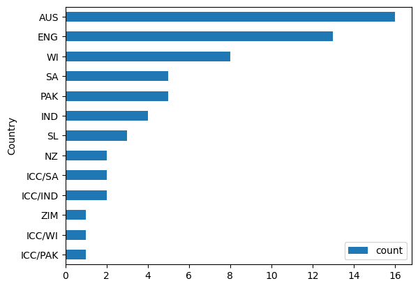
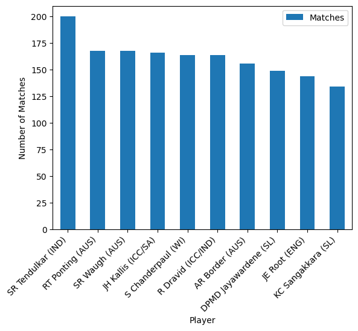

# Overview
This project was created for my preparation on focusing on data analyst roles. This will help me practice and apply all the skills I've learned from Data Analysis courses and tutorials. The project will focus on data cleaning, transformation and visualization using Python, Power BI and other tools.

The data was sourced from sports website [ESPN Cricket section](https://www.espncricinfo.com/records/highest-career-batting-average-282910). It contains records of highest career batting average in history of Cricket. It consists of players name and their country, years and matches played, and personal cricket records.

Through a series of Python scripts, I explore key questions such as average career length of the player, batting strike rate, players who played the most and number of players per country

# Questions

These are the questions I want to answer in my project:

1. What is the career average length?
2. What is the average batting strike rate for player who played more than 10 years in the league?
3. How many players played cricket even before the cricket league was established (1960)?
4. Max highest innings score by country
5. What are the averages of Hundreds, Fifties, Ducks (0) by country

# Tools I Used

For my deep dive into the data analyst job market, I harnessed the power of several key tools:

- **MS Excel:** Importing the datasets from a website and saving as a csv file.
- **Python:** For data cleaning and manipulation. I also used the following Python libraries:
    - **Pandas Library:** Data analysis and cleaning.
    - **Matplotlib Library:** simple and quick data visualization for analyzing data irregularities.
    - **Numpy Library:** Numerical calculation (Pandas backbone).
- **Jupyter Notebooks:** The tool I used to run my Python scripts which let me easily include my notes and analysis.
- **Visual Studio Code:** My ide for executing my Python scripts.
- **Power BI (Power Query)** Used for data transformation (power query) and interactive data visualization for deeper Data analysis insights.

# Data Preparation - Cleaning and Transformation

This section outlines the steps taken to prepare the data for analysis.

## Importing Dataset

Importing dataset from a website and loading it in jupyter notebook, followed by initial data cleaning tasks to ensure data quality.

Import the dataset using MS Excel thru From Web menu transform data using the link - [Highest Career Batting average](https://www.espncricinfo.com/records/highest-career-batting-average-282910) 


## Importing Dataset
Importing necessary libraries. 
```python
# Importing Libraries
import pandas as pd
import numpy as np
import matplotlib.pyplot as plt

# Reading and saving the data to df variable dataframe type
df = pd.read_excel(r'\Cricket_Data.xlsx', skiprows=1)
```

## Data Cleanup

```python
## Checking for dataframe infos like how many are non-null values, data type, index and column names, total rows and columns
df.info()
df.isnull().any()
```

```python
# Checking for unusual or uncommon values identified during initial dataset checking
df[df['BF'].str.contains('-')==1]
```

```python
## Replacing the uncommon values to NaN and assigning it to new dataframe name df_clean
df_clean = df.replace('-', np.nan)
df_clean[df_clean['Player'].isin(['ED Weekes (WI)', 'CL Walcott (WI)', 'Hon.FS Jackson (ENG)'])]
```

```python
# Replace NaN values to 0 and check if there are still irregular data
df_clean['Balls_Faced'] = df_clean['Balls_Faced'].fillna(0)
df_clean[df_clean['BF'].str.contains('-')==True]
df.isnull().any()
```

```python
## Remove unnecessary character/string for the following columns

# Column 'Highest_Inning_Score'
df_clean['Highest_Inning_Score'] = df_clean['Highest_Inning_Score'].str.split(r'*').str[0]

# Columns Balls_Faced
df_clean['Balls_Faced'] = df_clean['Balls_Faced'].str.split(r'+').str[0]

# Columns 4s and 6s
df_clean['4s'] = df_clean['4s'].str.split(r'+').str[0]
df_clean['6s'] = df_clean['6s'].str.split(r'+').str[0]
```

```python
# Checking and showing duplicated and their duplicate values
df_clean[df_clean['Player'].duplicated()==1]['Player'].to_list()
df_clean[df_clean['Player'].isin(df_clean[df_clean['Player'].duplicated()==1]['Player'].to_list())].sort_values('Player', ascending=False)

# Drop duplicate values 
df_clean.drop_duplicates(inplace=True)
```

## Change of Data Types

```python
# Change of data type
df_clean['Highest_Inning_Score'] = df_clean['Highest_Inning_Score'].astype('int')

df_clean = df_clean.astype({'Balls_Faced': 'int', '4s':'int', '6s':'int', 'Rookie_Year':'int', 'Final_Year':'int'})
```

## Column Transformation
```python
## Splitting string (Span column) to create new columns Rookie year and Final year

# Rookie year
df_clean['Rookie_Year'] = df_clean['Span'].str[:4] 
# alternative approach
df_clean['Span'].str.split('-').str[0]

# Final Year
df_clean['Span'].str[5:9]
# alternative approach
df_clean['Final_Year'] = df_clean['Span'].str.split('-').str[1]

# Checking string length on each element on column Span if there are more than 9 to see if the values on the column are consistent
df_clean['Span'][df_clean['Span'].apply(len) > 9].count()
```
```python
# Renaming columns using a list for clarity and readibility
df_clean.rename(columns={'Mat' : 'Matches', 'NO' : 'Not_Outs', 'HS' : 'Highest_Inning_Score', 'BF' : 'Balls_Faced', 'SR' : 'Batting_Strike_Rate'}, inplace=True)
```

```python
# Add new column of Career_Length
df_clean['Career_Length'] = df_clean['Final_Year'] - df_clean['Rookie_Year']
```

```python
# Dropping the Span column, no longer needed
df_clean.drop(columns='Span', inplace=True)
```

```python
## Splitting the Country from the Player column

# Extracting the Country code
df_clean['Country'] = df_clean['Player'].str.extract(r'\((.*?)\)')

# Extracting player name
df_clean['Player'] = df_clean['Player'].str.split(r'(').str[0]
```
### Plotting dataframe using Matplotlib in Python

```python
# Players per country
df_country_player.plot(kind='barh', x='Country', y='count')
```


```python
# Matches per player
df_clean[['Player', 'Matches']].head(10).sort_values('Matches', ascending=False).set_index('Player').plot(kind='bar')
plt.xticks(rotation=45, ha='right')
plt.ylabel('Number of Matches')
```


## Saving the dataframe to a new csv file for future reference 
```python
# Save new cleaned dataframe to a csv file
df_clean.to_csv('Cricket_clean_data.csv', index=False)
```

# Answering the Questions

### 1. What is the career average length?
```python
df_clean['Career_Length'].mean()
df_clean['Career_Length'].median()
```
#### Output: 
```python
13.03 / 14.0
```

### 2. What is the average batting strike rate for player who played more than 10 years in the league?
```python
df_clean[df_clean['Career_Length'] > 10]['Batting_Strike_Rate'].mean()
```
#### Output: 
```python
47.95
```

### 3. How many players played cricket even before the cricket league was established (1960)?
```python
df_clean[df_clean['Rookie_Year'] < 1960]['Player'].count()
```
#### Output:
```python
47.95
```

### 4. Max highest innings score by country
```python
df_clean.groupby('Country')['Highest_Inning_Score'].max().sort_values(ascending=False)
```
#### Output: 
```python
Country
ICC/WI     400
AUS        380
SL         374
WI         365
ENG        364
ICC/PAK    329
ICC/IND    319
PAK        313
SA         278
ICC/SA     277
IND        254
NZ         251
ZIM        232
```
### 5. What are the averages of Hundreds, Fifties, Ducks (0) by country`
```python
df_clean.groupby('Country')[[100,50,0]].mean().sort_values(by=[100], ascending=False)
```
#### Output:
```python
	        	100	    50	    0
Country			
ICC/SA		36.000000	48.000000	13.500000
ICC/WI		34.000000	48.000000	17.000000
ICC/IND		29.500000	47.500000	12.000000
IND	    	29.500000	36.500000	10.750000
SL	    	28.666667	44.000000	12.333333
ICC/PAK		25.000000	46.000000	15.000000
AUS	    	20.625000	28.375000	8.562500
NZ	    	18.500000	22.000000	6.000000
PAK	    	17.600000	23.600000	7.800000
WI	    	16.625000	25.625000	7.250000
ENG	    	12.538462	21.230769	4.307692
ZIM	   	12.000000	27.000000	5.000000
SA	  	9.800000	20.200000	3.400000
```
# Power BI Visualization

For interactive Power BI visualization click this link - [Cricket Batting PBI](https://app.powerbi.com/view?r=eyJrIjoiYTFmNDkzMjItNGU1NS00NWNhLTg3MTUtMWRlY2RjODU3ZWFmIiwidCI6ImE0ZTc4YjgxLTg3NGEtNDgzMi04OGYwLTEyYmQxNjMxMDhmNCIsImMiOjEwfQ%3D%3D)


# Insights

This project provided several general insights into the history data of highest cricket batting average:
- The average career year length of a cricketer is 13 years.
- Australia and England are the top two countries that had most of cricketer players.
- SR Tendulkar is one of the best cricketer as he always on atleast top 5 on every category.

# Learning and Challenges

Throughout this project, I deepened my understanding of the data analysis on a raw dataset and enhanced my technical skills in Python, especially in data manipulation and visualization. Here are a few specific things I learned:

- **Advanced Python Usage**: Utilizing libraries such as Pandas for data manipulation, Numpy and Matplotlib for data visualization, and other libraries helped me perform complex data analysis tasks more efficiently.
- **Data Cleaning Importance**: I learned that thorough data cleaning and preparation are crucial before any analysis can be conducted, ensuring the accuracy of insights derived from the data.

This project was not without its challenges, but it provided good learning opportunities:

- **Data Inconsistencies**: Handling missing or inconsistent data entries requires careful consideration and thorough data-cleaning techniques to ensure the integrity of the analysis.
- **Data Visualization**: Designing effective visual representations of complex datasets was challenging but critical for conveying insights clearly and compellingly.

#
<br></br>


